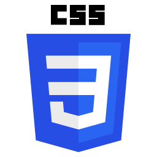
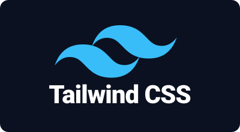
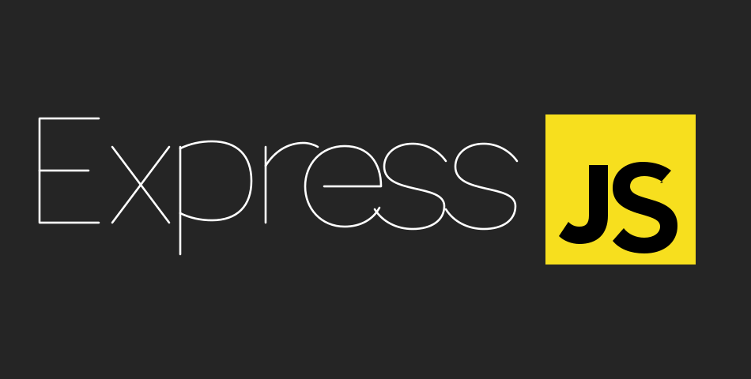
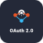
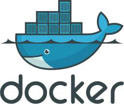

  

  

---
<table border="0" width="100%">
  <tr>
    <td width="60%" valign="top">
      
      
I'm <b>Siam Al Rabbi</b>, a Computer Science &amp; Engineering student and Full-Stack Developer passionate about scalable web architectures, responsive interfaces, and robust systems.

       
      <h4>⚡ Quick Facts</h4>
      <ul>
        <li> <b>Building:</b> <code>SkillSwap</code> — Full-Stack Freelance Skill Exchange Platform</li>
        <li> <b>Learning:</b> Deep Learning, AI integrations &amp; System Design</li>
        <li> <b>Ask Me:</b> React, Next.js, Node.js, Express, MongoDB, TypeScript</li>
        <li> <b>Looking to Collaborate:</b> High-impact full-stack web apps</li>
        <li> <b>Social:</b> <a href="https://linkedin.com/in/siam-ar">LinkedIn</a></li>
        <li> <b>Focus:</b> Clean, modular, type-safe engineering</li>
        <li> <b>Fun Fact:</b> The only thing faster than my compiler is my brain in the last hour before submission.</li>
      </ul>
    </td>
    <td width="40%" align="center" valign="middle">
      
      
    </td>
  </tr>
</table>

---

#  Tech Stack

## <code style="font-size: 1.45em; padding: 4px 14px; color: #38BDF8; font-weight: 800;">PROGRAMMING LANGUAGES</code>

  
  
  
  
  

 

## <code style="font-size: 1.45em; padding: 4px 14px; color: #38BDF8; font-weight: 800;">FRONTEND</code>

  
  
  
  
  

 

## <code style="font-size: 1.45em; padding: 4px 14px; color: #38BDF8; font-weight: 800;">BACKEND</code>

  
  

 

## <code style="font-size: 1.45em; padding: 4px 14px; color: #38BDF8; font-weight: 800;">DATABASES & ORMS</code>

  
  
  

 

## <code style="font-size: 1.45em; padding: 4px 14px; color: #38BDF8; font-weight: 800;">AUTH & SECURITY</code>

  
  
  
  

 

## <code style="font-size: 1.45em; padding: 4px 14px; color: #38BDF8; font-weight: 800;">DEVELOPER TOOLS</code>

<!-- Version Control -->

<!-- CI/CD & Automation -->

<!-- Containerization & Deployment -->

<!-- API Development & Testing -->

<!-- Operating System -->

---

<!-- ============ MASTER BORDER CONTAINER START ============ -->

## <code style="font-size: 1.45em; padding: 4px 14px; color: #38BDF8; font-weight: 800;">FEATURED PROJECT</code>

 

<!-- ============ GitHub-Supported Animated Title Banner ============ -->

  <em>A Modern Full-Stack Micro-Task &amp; Skill Exchange Marketplace</em>

<!-- ============ Modern, Flat-Style Call-to-Actions ============ -->

   
  
  
   

 

<!-- ============ Hero Screenshot with Inner Border ============ -->

  

 

<!-- ============ Core Capabilities / Features ============ -->

## <code style="font-size: 1.45em; padding: 4px 14px; color: #38BDF8; font-weight: 800;">KEY FEATURES</code>

 

<table width="100%" style="border: none;">
  <tr>
    <td width="50%" style="background: rgba(255, 255, 255, 0.02); border: 1px solid rgba(255, 255, 255, 0.08); border-radius: 12px; padding: 20px; vertical-align: top;">
      <h4 style="color: #fff;">🔐 Better Authentication</h4>
      
Secure authentication with Better Auth, featuring Google OAuth, persistent sessions, and protected user roles.

    </td>
    <td width="50%" style="background: rgba(255, 255, 255, 0.02); border: 1px solid rgba(255, 255, 255, 0.08); border-radius: 12px; padding: 20px; vertical-align: top;">
      <h4 style="color: #fff;">💳 Stripe Checkout Flow</h4>
      
Secure transaction processing with Stripe integration and automated checkout success tracking.

    </td>
  </tr>
  <tr>
    <td width="50%" style="background: rgba(255, 255, 255, 0.02); border: 1px solid rgba(255, 255, 255, 0.08); border-radius: 12px; padding: 20px; vertical-align: top;">
      <h4>⚡ High Performance</h4>
      
Engineered with Next.js Server-Side Rendering (SSR) for instantaneous data loading from MongoDB.

    </td>
    <td width="50%" style="background: rgba(255, 255, 255, 0.02); border: 1px solid rgba(255, 255, 255, 0.08); border-radius: 12px; padding: 20px; vertical-align: top;">
      <h4>🛡️ Protected Route Guards</h4>
      
Role-specific dashboards tailored for Clients, Freelancers, and Administrators with full refresh safety.

    </td>
  </tr>
</table>

 

<!-- ============ Architecture & Stack ============ -->

## <code style="font-size: 1.45em; padding: 4px 14px; color: #38BDF8; font-weight: 800;">ARCHITECTURE &amp; TECH STACK</code>

 

  

    Separated micro-architecture featuring a Next.js client application paired with a robust Express &amp; MongoDB REST API server.
  

  <!-- Animated Tech Icons Row -->
  

   

  <!-- Structured Technology Breakdown -->
  <table width="100%" style="border: none; text-align: left; margin-top: 10px;">
    <tr>
      <td width="33%" style="vertical-align: top; padding: 10px;">
        <strong style="color: #fff; font-size: 0.9em;">Frontend App</strong>
        
Next.js 16, React 19, Tailwind CSS, HeroUI

      </td>
      <td width="33%" style="vertical-align: top; padding: 10px;">
        <strong style="color: #fff; font-size: 0.9em;">Backend Server</strong>
        
Node.js, Express 5 REST API

      </td>
      <td width="33%" style="vertical-align: top; padding: 10px;">
        <strong style="color: #fff; font-size: 0.9em;">Database &amp; Services</strong>
        
MongoDB Atlas, BetterAuth, Stripe.js

      </td>
    </tr>
  </table>

<!-- ============ MASTER BORDER CONTAINER END ============ -->

#  GitHub Statistics

  

 

---

# 🤝 Connect With Me

&nbsp;&nbsp;&nbsp;

&nbsp;&nbsp;&nbsp;

 

### 📫 Reach Me

📍 **Location:** Dhaka, Bangladesh 🇧🇩

📧 **Email:** siam.ar.nexus@gmail.com

📱 **Phone:** +880 1612890989

---

### 💙 Thanks for visiting my profile!

  

